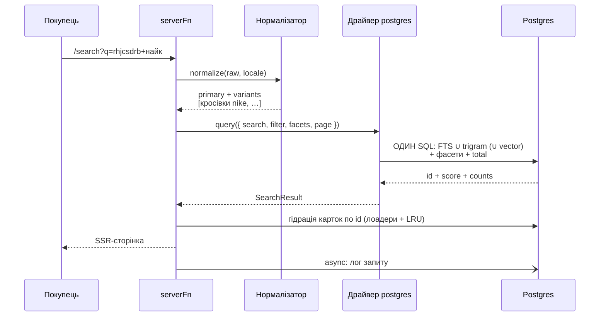

# Пошук вітрини й адмінки — дизайн

> **Статус: рішення ухвалене власником 2026-08-25**; у коді НЕ реалізовано.
> Доказова база — [дослідження](../research/2026-08-25-storefront-search-engine.md)
> (30 агентів, 3 прогони, чотири виміри працювали живими замірами на PostgreSQL
> 16.15 і Meilisearch 1.53.1). Імплементаційний план пишеться перед стартом;
> порядок відносно інших треків — [роадмап](../../tasks/platform-roadmap.md).
>
> 🔴 **Блокуюча передумова — сервер-first читання (V2-К1′), і вона виконана
> НЕРІВНОМІРНО:**
>
> | Контур | Стан на 2026-08-25 | Наслідок для цієї спеки |
> |---|---|---|
> | **Вітрина** | ✅ К1′а+б приземлені: браузер у БД не ходить, дані через `createServerFn` → `withActor` → Drizzle | Контури **П1–П5 розблоковані зараз** |
> | **Адмінка** | ❌ 53 файли / 215 звернень `.from()` з браузера, серверних функцій нуль ([`v2-state-map.md`](../../tasks/v2-state-map.md) §3.1) | Контур **П6 блокується К3** |
>
> Тобто пошук вітрини можна будувати негайно; адмінський пошук стає тонким
> шаром поверх готового порту одразу після К3.
>
> **Рамка проєкту** незмінна: клієнтів і магазинів у проді немає, зворотна
> сумісність не підтримується, різати по живому безпечно.

---

## 1. Мотивація

### 1.1. Поточний стан — факти з коду

- **Сторінки пошуку у вітрині немає взагалі.** Роут `/search` не існує; у
  `packages/simplycms/routes/storefront/_storefront/` його немає.
- **В адмінці пошук — `ilike '%q%'` по одній колонці**
  (`data-supabase/catalogRepository.ts:105`, `orderRepository.ts:113`,
  `admin/components/AddProductToOrder.tsx:53`).
- **У БД нуль пошукової інфраструктури**: ні `tsvector`, ні `pg_trgm`, ні
  `unaccent`, ні `pgvector` — у канонічних міграціях
  (`packages/simplycms/migrations/0001_init.sql`) нічого з цього немає.
- **Фільтри каталогу — клієнтські**: `CatalogSection.tsx` тримає `useState` +
  `useMemo`, URL не бере участі, SSR не бачить фільтрів
  ([`seo-ssr-faceted-navigation.md`](../../tasks/seo-ssr-faceted-navigation.md) §1.1).
- **Контент одномовний.** Таблиця `languages` (`schema.ts:100`) існує, але її
  єдині споживачі — пункт меню в сайдбарі й `PlaceholderPage`. У `products` одна
  колонка `name`; таблиці перекладів немає. Двомовність сьогодні — лише
  інтерфейс (каталоги i18n).

### 1.2. Чому це не можна закрити налаштуванням готового рушія

Для української мови жоден спеціалізований рушій не дає морфології:

| Факт | Перевірено |
|---|---|
| Snowball **не має** українського алгоритму (38 тек, 35 мов; російський є) | перелік `algorithms/` апстріму |
| PostgreSQL **не постачає** української конфігурації (PG 17 — 28 мов + `simple`; PG 18 — 29 + `simple`) | `select cfgname from pg_ts_config` на живому інстансі |
| Meilisearch **не має стемінгу для жодної мови**; кирилиця = NFKD + lowercase | `charabia` 0.10.0, перелік `src/normalizer/`, `src/segmenter/` |
| Typesense **відхиляє** `stem: true` для `uk` з HTTP 400 | `field.h:153` → `sb_stemmer_new(locale)` |

Ціна відсутності морфології — не «гірша релевантність», а **нуль**: на каталозі
10k товарів запит «холодильника» (родовий) дає **0 результатів** проти 4167 зі
словником; префіксний пошук цього не рятує.

🔴 **Точне формулювання, яке не можна послабити:** українську конфігурацію в
Postgres **зібрати можна** — трьома DDL зі стокового пакета `hunspell-uk`, і вона
працює правильно. Причина не робити цього **економічна**: ispell-словник
вантажиться в **приватну памʼять кожного бекенда** — виміряно **+64 МБ RSS на
зʼєднання** (14 664 → 78 768 kB) і 635–795 мс на першому виклику в сесії. При
пулі 5–10 зʼєднань це 320–640 МБ у контейнері БД, чий бюджет 150–350 МБ.
Лематизатор у Node — **одна копія на процес**.

### 1.3. Чому вирішувати треба зараз

- Контракти портів **заморожуються першим стороннім пакетом маркетплейсу**
  (B10 бекенд-контракту v2), а подачі відкриваються після К5.
- Фасетна навігація — окремий затверджений трек, і вона спирається на той самий
  запит і той самий індекс. Робити її окремо від пошуку означає зробити двічі.
- Схема БД зараз у стані повного рефакторингу (чистий baseline B13) — додати
  таблиці й розширення дешево саме тепер.

---

## 2. Зафіксовані рішення (П1–П16)

| # | Рішення |
|---|---|
| **П1** | **Пошук живе всередині Postgres магазину.** Жодного окремого пошукового сервісу в базовому стеку — інваріант «2 stateful-компоненти на тенанта» лишається цілим. Зовнішні рушії (Meilisearch, Manticore, Typesense) — **опційні драйвери-плагіни маркетплейсу**, ніколи не обовʼязкові. Анти-приклад — Magento 2.4 |
| **П2** | **Мовна «розумність» — у Node-процесі.** Нормалізація (розкладка, апостроф, транслітерація, гомогліфи) і лематизація виконуються в застосунку і застосовуються **симетрично** до тексту сутності при індексації і до запиту при пошуку. У Postgres tsvector будується конфігурацією `simple` поверх уже лематизованого тексту |
| **П3** | **Мовні пакети — механізм, а не хардкод.** Ядро везе: повний пакет `uk` (hunspell-мапа), пакет `en`, і решту мов, які підтримує Snowball, тонкими обгортками над JS-портами стемерів. 🔴 Пакет вважається готовим **лише після проходження фікстури парадигм** — наявність стемера підтримкою мови не є |
| **П4** | **Вимоги до лематизатора — контрактні, не побажальні:** (а) чиста функція, яка **ніколи не кидає** (падіння нормалізації не має обнуляти індексований текст); (б) **єдина точка виклику** для індексації і для запиту; (в) **версійована** — версія пакета пишеться в рядок індексу, її зміна детермінує переіндексацію; (г) покрита тестом «незлематизований запит по злематизованому індексу» |
| **П5** | **Індекс — окрема таблиця `search_documents`**, ключована `(entity_type, entity_id, locale)`, а не колонка на `products`. 🔴 **Локаль у ключі з першого дня**, поки магазин одномовний: ціна сьогодні — одна колонка, ціна потім — міграція по всьому флоту плюс повна переіндексація кожного магазину |
| **П6** | **Порт `SearchProvider`** за референсною формою `MediaProvider` (порт + драйвери + лінт-заборона прямих викликів). Драйвер `postgres` — дефолт і єдиний обовʼязковий. Контракт стережеться conformance-китом за зразком `assertThemeViewsConformance` |
| **П7** | 🔴 **`search` — ПОЛЕ обʼєкта запиту, а не окремий метод порту.** Один `query({ search, filter, sort, facets, page })` обслуговує вітрину, адмінку й агента. Прецедент: Directus — єдиний продукт, що ділить пошук між UI і AI-агентом одним кодом, саме тому що `search` живе поруч із `filter`. Анти-прецедент: Twenty, де `searchVector` внесено до `EXCLUDED_FIELD_NAMES_FROM_AGENT_TOOL_SCHEMA` і агент не має доступу до пошуку власного продукту |
| **П8** | **Порт повертає `id + score + фасети`, ніколи не картки товарів.** Гідрація — окремим читанням із того самого Postgres через наявні лоадери й in-process LRU. Тоді зміна драйвера фізично не здатна змінити картку, а контракт тем v3 лишається незачепленим |
| **П9** | **`pg_trgm` — рівноправний другий контур, а не лише фолбек.** Для української це не «толерантність до одруків», а страховка від помилки лематизатора: «кросівок» і «кросівки» ділять 6 спільних триграм, тоді як `tsvector('simple')` вважає їх різними лексемами. Результати обох контурів **зливаються**, а не викликаються послідовно |
| **П10** | **Злиття контурів — тільки по ПОЗИЦІЯХ (RRF), ніколи по сирих скорах.** `score = Σ weightᵢ / (k + rankᵢ)`, `k` параметризований. Лінійне змішування `w₁·cosine + w₂·ts_rank` вироджується в один контур, бо шкали несумісні |
| **П11** | **Індексація асинхронна, через чергу-дедуплікатор**, а не синхронним тригером. Це прибирає GIN з критичного шляху запису і дозволяє батчеву переіндексацію при зміні мовного пакета. Прецедент — Saleor |
| **П12** | **Семантика опційна і вимкнена за замовчуванням.** Порт `EmbeddingProvider` із драйверами `none` (дефолт) / `http` (будь-який OpenAI-сумісний ендпоінт) / `local` (opt-in). 🔴 **Без залежності від будь-якого AI-SDK** — `/v1/embeddings` це один `fetch`. Відсутність провайдера деградує пошук до лексичного, ніколи не ламає |
| **П13** | **Лог пошукових запитів — з першого дня.** Українського e-commerce бенчмарку не існує, тож якість власного пошуку й доцільність семантики можна довести **лише власними даними**. 🔴 Лог не містить ідентифікатора користувача, IP і будь-яких персональних даних — тільки запит, кількість результатів, клік |
| **П14** | **Образ Postgres тенанта пінується: `pgvector/pgvector:pg17`.** pgvector в офіційному образі `postgres` відсутній; наш образ везе `pg_trgm`, `unaccent`, `pgvector` і (опційно) RUM. Мажор фіксується на **17** — це закриває борг К1а-1 (розходження 16.13 локально / 17 у CI) |
| **П15** | **Рішення про агентний фреймворк відкладене.** У цьому треку зʼявляється лише `EmbeddingProvider`. Агент отримає пошук як інструмент через той самий порт (П7), коли трек агентів настане |
| **П16** | **Без зворотної сумісності.** `ilike`-пошук в адмінці й клієнтський `useMemo`-фільтр каталогу зносяться в тих самих контурах, де приземлюється заміна |

---

## 3. Цільова архітектура

```mermaid
flowchart TB
    subgraph CLIENTS[Споживачі]
        B[Покупець<br/>/search, фасети]
        A[Адмінка<br/>після К3]
        AG[Наш агент<br/>майбутнє]
        EXT[Чужий агент<br/>MCP/UCP]
    end

    subgraph NODE[Node-процес магазину]
        SF[createServerFn]
        PORT["SearchProvider.query()<br/>search — поле запиту"]
        LANG["Мовний шар<br/>нормалізація + лематизація<br/>~1 МБ на процес"]
        DRV["драйвер postgres"]
        SF --> PORT --> DRV
        PORT -.-> LANG
        DRV -.-> LANG
    end

    subgraph PG[(Postgres магазину)]
        SD["search_documents<br/>tsvector + trgm + опц. vector"]
        SYN[search_synonyms]
        Q[search_index_queue]
        LOG[search_queries]
        SRC[products / sections /<br/>property_options]
    end

    B --> SF
    A --> SF
    AG --> PORT
    EXT --> SF
    DRV --> SD
    DRV --> SYN
    SRC -.->|подія зміни| Q
    Q -.->|батч| SD
    DRV --> LOG

    PORT -.->|опційно| MEIL["драйвер meilisearch<br/>плагін маркетплейсу"]
```

**Що НЕ зʼявляється:** жодного нового контейнера, процесу, черги-сервісу чи
зовнішньої залежності. Усе — таблиці й індекси в наявній БД плюс код у наявному
Node-процесі.

---

## 4. Модель даних

### 4.1. `search_documents` — індекс

```sql
create type search_entity as enum ('product', 'section', 'property_option');

create table search_documents (
  entity_type        search_entity not null,
  entity_id          uuid          not null,
  locale             varchar(10)   not null,

  -- Лематизовані поля. Пише КОД (мовний шар), не Postgres.
  title_lex          text not null default '',
  attrs_lex          text not null default '',   -- бренд, властивості, категорія
  body_lex           text not null default '',   -- опис

  -- Точні токени БЕЗ лематизації: артикули, коди, моделі.
  exact_tokens       text not null default '',

  -- Нормалізований, але НЕ лематизований текст — для триграм і автодоповнення.
  title_norm         text not null default '',

  -- tsvector рахує Postgres із того, що вже нормалізоване кодом.
  tsv tsvector generated always as (
    setweight(to_tsvector('simple', title_lex),    'A') ||
    setweight(to_tsvector('simple', exact_tokens), 'A') ||
    setweight(to_tsvector('simple', attrs_lex),    'B') ||
    setweight(to_tsvector('simple', body_lex),     'C')
  ) stored,

  -- Опційний семантичний шар (П12). Розмірність — параметр, не константа.
  embedding          halfvec(384),
  embedding_model    varchar(64),

  lang_pack          varchar(32)  not null,
  lang_pack_version  varchar(32)  not null,
  source_updated_at  timestamptz,
  indexed_at         timestamptz  not null default now(),

  primary key (entity_type, entity_id, locale)
);

create index search_documents_tsv_idx
  on search_documents using gin (tsv);

-- Триграми: два індекси різного призначення.
create index search_documents_title_trgm_gin_idx          -- фільтрація (%)
  on search_documents using gin (title_norm gin_trgm_ops);
create index search_documents_title_trgm_gist_idx         -- ORDER BY <-> LIMIT k
  on search_documents using gist (title_norm gist_trgm_ops);
```

🔴 **`GENERATED ALWAYS … STORED` можливий саме тому, що конфігурація —
константа `simple`.** Перевірено на живому PG: generated column із per-row
конфігом (`to_tsvector(lang::regconfig, name)`) падає з
`ERROR: generation expression is not immutable`. Тобто «нативний» шлях запікає
мову в схему, а наш — робить її параметром коду. **Мультимовність не потребує
ні тригера, ні N колонок, ні N індексів.**

🔴 **Окрема таблиця, а не колонка на `products`** — прецедент Discourse
(`post_search_data`) і Vendure (`search_index_item`). Виміряний мотив: на
спільній таблиці UPDATE тексту коштує −8,8 % throughput і збиває HOT-оновлення;
на окремій — 0 %, і переіндексація не блокує картку товару.

**Індекс HNSW для `embedding` створюється лише тоді, коли семантика ввімкнена**
— окремою міграцією контуру П7, не в базовій.

### 4.2. `search_index_queue` — черга-дедуплікатор

```sql
create table search_index_queue (
  entity_type search_entity not null,
  entity_id   uuid          not null,
  reason      varchar(16)   not null,   -- 'upsert' | 'delete' | 'reindex'
  enqueued_at timestamptz   not null default now(),
  primary key (entity_type, entity_id)   -- upsert = дедуплікація за побудовою
);
```

Запис у чергу — в **тій самій транзакції**, що й зміна сутності. Обробка —
фоновою батчевою задачею в Node-процесі (за зразком Saleor: батчі по ~100).

### 4.3. `search_synonyms` — синоніми як дані

```sql
create table search_synonyms (
  id         uuid primary key default gen_random_uuid(),
  locale     varchar(10) not null,
  term       text        not null,   -- нормалізована ЛЕМА
  expansions text[]      not null,   -- теж леми
  is_builtin boolean     not null default false,
  created_at timestamptz not null default now(),
  unique (locale, term)
);
```

🔴 Ядро везе **преднаповнений** набір (`is_builtin = true`): укр↔рос товарні пари
(`праска`/`утюг`, `парасолька`/`зонт`, `краватка`/`галстук`, `навушники`/`наушники`)
і загальні e-commerce-синоніми (`мобільний`/`смартфон`/`телефон`). Мерчант
доповнює з адмінки. **Не покладати наповнення на власника магазину як єдиний
шлях** — інакше «розумний пошук з коробки» не виконується.

Цілі синонімів — **леми**, не словоформи: виміряно, що з правильними
цілями-лемами набір дає 7/7 на тестовій вибірці, зі словоформами — ні.

### 4.4. `search_queries` — лог (П13)

```sql
create table search_queries (
  id                bigserial primary key,
  occurred_at       timestamptz not null default now(),
  locale            varchar(10) not null,
  raw_query         text        not null,
  normalized_query  text        not null,
  variant_kinds     text[],          -- ['layout','translit','synonym']
  result_count      integer     not null,
  duration_ms       integer,
  clicked_entity_id uuid,
  clicked_position  integer
);
```

🔴 **Жодного `user_id`, IP чи UA.** Лог — інструмент якості пошуку, не
аналітики користувачів; GDPR-мінімізація за побудовою. Ретенція — параметр
магазину, дефолт 180 днів, прибирання тією ж фоновою задачею.

### 4.5. Гранти

Канон грантів — `packages/simplycms/migrations/0002_grants.sql`, гранти як код:

| Таблиця | `app_user` | `app_admin` |
|---|---|---|
| `search_documents` | `SELECT` | `SELECT, INSERT, UPDATE, DELETE` |
| `search_synonyms` | `SELECT` | `ALL` |
| `search_index_queue` | — | `ALL` |
| `search_queries` | `INSERT` | `SELECT, DELETE` |

🔴 **RLS на `search_documents` немає** — як і на каталозі. Отже фільтрація
видимості (`is_active`) — **обовʼязок коду**, як і в решті вітрини після К1′.
Індексуються лише активні сутності; при деактивації товару рядок індексу
видаляється через чергу.

---

## 5. Мовний шар

### 5.1. Контракт мовного пакета

```ts
// simplycms/lang (T1 — чисті функції + дані, нуль рантайм-залежностей)

export interface LanguagePack {
  readonly code: string;                    // 'uk' | 'en' | 'de' | …
  readonly version: string;                 // 🔴 пишеться в рядок індексу (П4в)

  /** Апостроф, регістр, діакритика, гомогліфи лат↔кир. НІКОЛИ не кидає. */
  normalize(text: string): string;

  /** Словоформа → лема. НІКОЛИ не кидає; на невідомому слові повертає вхід. */
  lemma(token: string): string;

  readonly stopWords: ReadonlySet<string>;

  /** Розкладки для фліпу запиту; порожньо для мов, де це не має сенсу. */
  readonly keyboardLayouts?: readonly KeyboardLayout[];

  /** Транслітерація в обидва боки — для брендів. */
  readonly translit?: TranslitRules;
}
```

### 5.2. Український пакет — як будується

1. **Джерело** — hunspell-словники `uk_UA` з теки `distr/hunspell` апстріму
   `dict_uk`, **MPL 1.1**, узяті напряму з апстріму.
   🔴 **Не** брати дані ВЕСУМ (CC BY-NC-SA 4.0, NonCommercial), **не** брати npm
   `dictionary-uk` (GPL-3.0), **не** брати npm `ukrstemmer` (GPLv2) — усі три
   несумісні з MIT-ядром.
2. **Збірка мапи** — офлайн-скрипт репозиторію розгортає афікси у мапу
   `словоформа → лема` і кладе в пакет як дані.
3. **Каталог-скоуп у рантаймі** — при побудові індексу магазину мапа звужується
   до лем, присутніх у каталозі: виміряно ~200 тис. пар = **5,0 МБ сирих /
   0,7 МБ gzip** на 10k товарів. Одна копія на процес.

**Якість, яку це дає** (виміряно): 25/25 реалістичних відмінкових парадигм
(120 словоформ) зводяться до спільної леми, включно з чергуванням `стіл/стола`
і `кросівки/кросівок`.

### 5.3. Решта мов

Для мов, які підтримує Snowball, `lemma()` — обгортка над готовим JS-портом
стемера (`@orama/stemmers`, Apache-2.0, 28 мов). Пакет — десяток рядків клею
плюс стоп-слова.

🔴 **Гейт якості обовʼязковий для кожного пакета.** Той самий `@orama/stemmers`
на **українській** дав лише 8 з 16 груп однокореневих слів (чотири системні
класи промахів: випадний голосний, надмірне відтинання на `-и`, палаталізація
`к→ц`, непослідовність прикметників) — саме тому, що Snowball української не
має і це саморобка, а не порт еталона. Німецький і французький там — точні
порти. **Наявність стемера підтримкою мови не є**; пакет вважається готовим
після проходження фікстури парадигм своєї мови.

### 5.4. Нормалізація запиту — що робить ядро понад пакет

Три речі, яких не дає жоден рушій (Manticore закриває лише першу):

| Механізм | Приклад |
|---|---|
| Фліп розкладки | `rhjcsdrb` → `кросівки`, `[jkjlbkmybr` → `холодильник` |
| Транслітерація в обидва боки | `найк` ↔ `nike`, `карчер` ↔ `Karcher` |
| Синоніми з БД (леми) | `утюг` → `праска` |

Виробляють **варіанти запиту**, які драйвер обʼєднує дизʼюнкцією і бере
максимальний score. 🔴 Варіанти будує **ядро**, не драйвер — тоді фіча дістається
всім драйверам одразу.

Плюс дві дешеві речі з непропорційним ефектом: нормалізація **трьох варіантів
апострофа** (`'`, `ʼ`, `’`) в один символ, і «можливо, ви мали на увазі» через
suggest словника.

---

## 6. Контракт порту

Розміщення: `packages/simplycms/src/contracts/ports/search.ts` (**T0**, нуль
рантайм-залежностей, поруч із наявними `CatalogRepository` / `MediaProvider`).

```ts
export type SearchEntity = 'product' | 'section' | 'property_option' | (string & {});

/** 🔴 П7: search — ПОЛЕ запиту, поруч із filter/sort/page. */
export interface CatalogQuery {
  readonly entity: SearchEntity;
  readonly locale: string;
  readonly search?: string;              // СИРИЙ рядок; нормалізує ядро
  readonly filter?: SearchFilter;        // дерево, не рядок
  readonly sort?: readonly SearchSort[];
  readonly facets?: readonly SearchFacetRequest[];
  readonly page: SearchPage;
  readonly options?: SearchQueryOptions;
}

export type SearchFilter =
  | { readonly all: readonly SearchFilter[] }
  | { readonly any: readonly SearchFilter[] }
  | { readonly none: SearchFilter }
  | { readonly field: string; readonly op: SearchOp };

export interface SearchHit {
  readonly id: string;
  readonly groupId?: string;             // товар, коли документ = модифікація
  readonly score: number;
  readonly matchedVia?: readonly ('lexical' | 'trigram' | 'vector')[];
}

/** Чесний лічильник: eq — точно стільки, gte — не менше. */
export interface SearchTotal {
  readonly value: number;
  readonly relation: 'eq' | 'gte';
}

/** 🔴 П8: тільки посилання. Жодних даних для картки. */
export interface SearchResult {
  readonly hits: readonly SearchHit[];
  readonly facets: Readonly<Record<string, SearchFacetResult>>;
  readonly total: SearchTotal | null;
  readonly nextCursor?: string;
}

/** Декларація можливостей — не здогад. */
export interface SearchDriverCapabilities {
  readonly typoTolerance: boolean;
  readonly prefixMatch: boolean;
  readonly synonyms: boolean;
  readonly semantic: boolean;
  readonly facetKinds: readonly SearchFacetRequest['kind'][];
  readonly exactCount: boolean;
  readonly cursorPagination: boolean;
  readonly filterOps: readonly SearchOp['kind'][];
}

export interface SearchProvider {
  readonly id: string;                   // 'postgres' | 'meilisearch' | …
  readonly capabilities: SearchDriverCapabilities;

  query(q: CatalogQuery): Promise<SearchResult>;
  suggest(q: SuggestQuery): Promise<SuggestResult>;
  health(): Promise<{ readonly ok: boolean; readonly detail?: string }>;
}

/** Індексація — ОКРЕМИЙ порт: драйвер має бути тупим. */
export interface SearchIndexerPort {
  enqueue(e: { entity: SearchEntity; ids: readonly string[]; reason: 'upsert' | 'delete' }): Promise<void>;
  drain(limit?: number): Promise<{ processed: number; remaining: number }>;
  reindex(input?: { entity?: SearchEntity }): Promise<{ jobId: string }>;
  status(): Promise<readonly SearchIndexStatus[]>;
}

/** Нормалізація — теж окремо: магазин може підмінити своєю. */
export interface SearchQueryNormalizerPort {
  normalize(raw: string, ctx: { locale: string }):
    { readonly primary: string; readonly variants: readonly string[] };
}

/** Єдиний спосіб сказати «не вмію». Мовчазне ігнорування заборонене. */
export interface SearchUnsupportedError extends Error {
  readonly driverId: string;
  readonly feature: string;
  readonly remedy?: string;    // 'CREATE EXTENSION IF NOT EXISTS pg_trgm;'
}
```

**Три окремі порти** (`SearchProvider`, `SearchIndexerPort`,
`SearchQueryNormalizerPort`) — драйвер має бути тупим: дай запит, віддай id.
Хто і коли вирішує переіндексувати — справа ядра і не мусить мінятись при зміні
рушія.

**Розміщення реалізації:** `packages/simplycms/src/search/` (**T2** — потребує
`simplycms/db`), мовні пакети — `packages/simplycms/src/lang/` (**T1**).
🔴 Обидві теки додаються в `eslint.tier-zones.mjs` разом із кодом; негативний
контроль — `tests/tier-boundary.test.ts`.

🔴 **Порт позначається `@experimental` і НЕ експортується з `plugin-sdk`** доти,
доки conformance не зелений на двох драйверах. Маркетплейс його не бачить і не
може заморозити.

---

## 7. Конвеєр запиту



**Правила виконання:**

1. 🔴 **Верхня межа зматчених рядків перед ранжуванням — обовʼязкова.** Вартість
   `ts_rank` лінійна за кількістю матчів (~3,7 мкс/рядок); стеля настає на
   ~50 000. Драйвер завжди обмежує кандидатів до ранжування.
2. **Точний `COUNT(*)` для великих результатів не робиться** — `SearchTotal`
   віддає `relation: 'gte'`. Виміряно: точний count на 411k матчів — 315 мс.
3. **Триграмний контур — рівноправний** (П9): результати зливаються RRF, а не
   викликаються послідовно.
4. **Точні токени (SKU/артикул) мають вагу A і не лематизуються** — векторний і
   морфологічний шари на них систематично гірші за точний збіг.
5. Конфігурація `simple` **однакова** на боці індексу й запиту, і це під тестом:
   у Mattermost індекси створювались із зашитим `english`, а запити йшли через
   `default_text_search_config` — і пошук **ніколи не використовував індекси**.

---

## 8. Фасети

Фасети рахуються **тим самим SQL, у тій самій транзакції**, що й пошук —
`GROUP BY` поверх CTE з hits. Виміряно на нашій схемі: **0,46 мс** на 10k і
4,57–90 мс на 100k товарів.

Це найсильніший самостійний аргумент за Postgres: жодної синхронізації двох
сховищ, жодного дрейфу лічильників, жодного «товар є у фасеті, але його немає в
каталозі».

Контракт фасета відтворює модель Meilisearch (взяту як цільову): точні
лічильники значень, діапазонні бакети, `stats` (min/max). Ліміт значень на
фасет — параметр із дефолтом, бо саме він найбільше впливає на латентність при
високій кардинальності.

**Стик із фасетною навігацією:** [`seo-ssr-faceted-navigation.md`](../../tasks/seo-ssr-faceted-navigation.md)
описує URL-схему, політику індексованості й single-facet лендинги. Ця спека дає
під неї **виконавчий шар**: `filter` + `facets` у `CatalogQuery` і серверний
підрахунок. Клієнтський `useMemo`-фільтр (`CatalogSection.tsx`) зноситься в
контурі П5.

---

## 9. Семантичний шар (опційний, П12)

```ts
export interface EmbeddingProvider {
  readonly id: 'none' | 'http' | 'local' | (string & {});
  readonly dimensions: number;
  readonly model: string;
  embed(texts: readonly string[], opts?: { signal?: AbortSignal }): Promise<Float32Array[]>;
}
```

- **Драйвер `none`** — дефолт. Семантика не бере участі у злитті; пошук
  повністю робочий.
- **Драйвер `http`** — будь-який OpenAI-сумісний `/v1/embeddings`: наша хмара,
  Ollama, vLLM, LocalAI, комерційний API. 🔴 **Без AI-SDK** — один `fetch`.
- **Драйвер `local`** — opt-in, з явним попередженням про памʼять.

**Референсна модель** — `multilingual-e5-small` (MIT, 384 виміри). 🔴 Не
`jina-embeddings-v3` попри кращі цифри на українській — CC-BY-NC-4.0.

**Зберігання** — `halfvec(384)` у тій самій таблиці: виміряно ~16 МБ на 10k
товарів разом із HNSW. Розмірність — **параметр**, не константа
(`vector(1536)` на 100k = ~1,2 ГБ — вихід за бюджет у 4–5 разів).

**Злиття** — RRF (П10). Ваги на бік лексики: каталог із артикулами й
партномерами — саме той випадок, де dense-ретрив систематично програє.

**ANN-індекс не обовʼязковий**: до ~50 000 товарів точний скан швидший за
клопіт. При вмиканні HNSW — `hnsw.iterative_scan = relaxed_order`, бо фасетна
фільтрація це рівно той сценарій, де HNSW без нього повертає одиниці кандидатів.

🔴 **Рішення про ввімкнення семантики ухвалюється на даних із логу (П13),
а не на відчутті.** Виміряний виграш гібриду над найкращим одиночним методом на
профільному e-commerce-бенчмарку — +1,2 % nDCG (базовий RRF); заявлені +7,4 %
досягаються лише після доменного тюнінгу.

**Що в цьому треку НЕ робиться:** LLM у шляху запиту (виміряно $19,20/міс на
один магазин — 66 % тарифу $29), реранкер через API ($10/міс — 34 % тарифу),
генеративні відповіді. Це — плагіни маркетплейсу з ключем власника магазину.

---

## 10. Адмінський пошук (контур П6 — блокується К3)

Той самий порт, інший `entity` і інша роль (`app_admin`). Замінює три поточні
`ilike`-місця. Особливості:

- Реєстр сутностей із `transformQuery` (наприклад, зняти провідну решітку з
  номера замовлення) — патерн Medusa.
- Пошук по замовленнях і користувачах **не індексується в `search_documents`**:
  там інша модель приватності й інші обсяги; для них достатньо тріграмних
  індексів по цільових колонках. Порт це виражає різними `entity` з різними
  `capabilities`.

🔴 **Не стартувати до К3.** Адмінка не має серверного шару взагалі; будувати
пошук у браузерному контурі означає написати код, який К3 одразу перепише.

---

## 11. Агентна поверхня

Готовність до агентів **не є окремою підсистемою** — це наслідок П7. Коли
настане трек агентів:

- **Наш агент** отримує `query()` як інструмент (`createTool`) — той самий код,
  що й вітрина.
- **Чужий агент** — через MCP/UCP-адаптер поверх того самого порту.
  UCP-інструмент називається `search_catalog(query, filters)` і приймає **текст**,
  не вектор — зовнішньому агенту байдуже, що всередині.
  🔴 **Схему UCP не вшивати в ядро**: за пів року `search_shop_catalog` у Shopify
  став `search_catalog`, Catalog MCP мігрував на UCP, старий ендпоінт вимкнено.
  Між портом і протоколом — адаптер.

Побічний, але вагомий ефект: один порт означає **одне джерело правди про
наявність і ціну**. Агент не може пообіцяти те, чого не показує пошук — це
мітигація відповідальності, а не лише економія коду.

---

## 12. Інфраструктура

### 12.1. Образ і версія Postgres (П14)

| Параметр | Рішення | Мотив |
|---|---|---|
| Образ | **`pgvector/pgvector:pg17`** | pgvector в офіційному `postgres` відсутній |
| Мажор | **17**, зафіксований | CI вже на `postgres:17`; **закриває борг К1а-1** (локальний харнес 16.13 vs CI 17) |
| Розширення в образі | `pg_trgm`, `unaccent`, `pgvector` | усі PostgreSQL License |
| Опційно | RUM | прискорювач ранжування; вмикати за потреби |
| Локаль | `en_US.UTF-8` / `C.UTF-8` **зафіксувати** | при `LC_CTYPE=C` тріграми на кирилиці ламаються |
| `--shm-size` | ≥ `maintenance_work_mem` | потрібно для паралельної побудови HNSW |

Розширення створюються **міграцією**, не вручну; наявність перевіряється в
рантаймі з типізованою причиною відмови (патерн Teable), бо магазин на чужому
Postgres не зобовʼязаний мати superuser.

### 12.2. Що це означає для решти тулчейну

- `test-harness/pg` і CI-job `schema` — на PG 17 (усунення розходження).
- Локальний dev-стенд і `pnpm db:demo` — на тому самому образі.
- `simplycms doctor` — перевірка наявності розширень із підказкою-`remedy`.

### 12.3. Деградація на чужому Postgres

| Немає | Наслідок |
|---|---|
| `pg_trgm` | немає одруків і автодоповнення; лексика працює |
| `unaccent` | нормалізація повністю лягає на код (вона там і так) |
| `pgvector` | семантика недоступна; драйвер `none` |
| нічого з переліченого | базовий лексичний пошук **усе одно працює** |

🔴 **Базовий шар мусить працювати на будь-якому Postgres.** Наш образ дає
прискорювачі, а не саму функцію.

---

## 13. Гейти й тести

| Гейт | Що доводить |
|---|---|
| `tests/lang-pack-conformance` | Кожен заявлений мовний пакет проходить фікстуру парадигм своєї мови. 🔴 Пакет без фікстури — не пакет |
| `tests/search-symmetry` | Індексація і запит проходять **той самий** мовний шар. Класичний спосіб мовчки зламати пошук |
| `tests/search-driver-conformance` | Для кожної опційної можливості драйвер або відповідає коректно, або кидає `SearchUnsupportedError`. Два канали запуску, як у тем |
| `tests/search-visibility` | Неактивні сутності не потрапляють у видачу (RLS на індексі немає — це обовʼязок коду) |
| `tests/tier-boundary` | Теки `lang/` і `search/` не порушують напрямок тірів |
| `test:schema` | Таблиці, індекси, гранти, розширення — у каноні міграцій |
| Бенчмарк-фікстура | Каталог 10k товарів: латентність запиту, фасетів і переіндексації в межах бюджету |

🔴 **Окремо — негативний контроль лематизатора:** мутація «пакет повертає вхід
без змін» мусить **червонити** `search-symmetry`. Урок К1а-9 діє й тут:
структурна перевірка не є доказом поведінки.

---

## 14. Контури (для імплементаційного плану)

| # | Контур | Передумова | Склад |
|---|---|---|---|
| **П1** | Фундамент | ✅ К1′ | Міграції (`search_documents`, `search_index_queue`, `search_synonyms`, `search_queries`, гранти, розширення); пін образу й мажора PG; тір-зони |
| **П2** | Мовний шар | П1 | Механізм пакетів; повний `uk` (конвеєр hunspell → мапа); `en`; решта Snowball-мов; нормалізатор (розкладка, транслітерація, апостроф); фікстури парадигм |
| **П3** | Порт і драйвер | П1 | Контракт T0; драйвер `postgres`; conformance-кит; лінт-заборона прямих викликів |
| **П4** | Індексатор | П2, П3 | Черга, батчева задача, повна переіндексація, версіювання пакета, знос неактивних |
| **П5** | Вітрина | П3, П4 | Роут `/search`; автодоповнення; фасети в URL + серверний підрахунок; знос клієнтського `useMemo`-фільтра; лог запитів; SSR і SEO-політика за спекою фасетів |
| **П6** | Адмінка | 🔴 **К3** | Заміна трьох `ilike`-місць; реєстр сутностей; пошук по замовленнях/користувачах |
| **П7** | Семантика | П5 + рішення на даних логу | `pgvector`-колонка й індекс; `EmbeddingProvider`; RRF-злиття |
| **П8** | Агентна поверхня | трек агентів | MCP/UCP-адаптер поверх порту |

**Порядок:** П1 → П2 ∥ П3 → П4 → П5. П6 чекає К3. П7 і П8 — за окремим рішенням.

---

## 15. Поза скоупом (свідомо)

- **Переклади контенту.** Платформа їх не моделює (`products.name` — одна
  колонка; `languages` — заглушка). Це рішення рівня платформи, більше за пошук.
  Спека лише **готує ґрунт**: локаль у ключі індексу з першого дня (П5).
- **CJK.** Мови без словорозділювачів потребують сегментації — інший клас задачі
  (`pgroonga`, ICU). Саме тут проходить справжня межа зовнішнього рушія
  (прецедент Docmost), і для української вона не спрацьовує.
- **LLM у шляху запиту**, реранкер через API, чат-асистент — плагіни
  маркетплейсу з ключем власника магазину.
- **Персоналізація видачі** й merchandising-правила (пінінг, бусти) — після
  того, як зʼявиться лог із реальними даними.
- **`pg_textsearch`** (Tiger Data, справжній BM25 під PostgreSQL License) —
  переглянути через ~півроку: наразі v1.5.0-dev і потребує
  `shared_preload_libraries`.

---

## 16. Ризики та мітигації

| Ризик | Мітигація |
|---|---|
| 🔴 **Лематизація в застосунку — шлях, якого не пройшов ніхто з восьми вивчених продуктів** | Контрактні вимоги П4 (чистота, єдина точка, версіювання, тест симетрії) + обовʼязковий тріграмний контур, що працює **без** лематизації. Це страховка від помилки мовного шару, а не лише від одруків |
| Мапа форма→лема розходиться з каталогом після імпорту товарів | Версія пакета в рядку індексу; зміна версії детермінує переіндексацію через ту саму чергу |
| GIN додає хвіст затримок на запис | Виміряно: UPDATE ціни −0,13 % (ціни в `product_prices`, не в індексованій таблиці); хвіст p99.99 115 мс. `fastupdate` — відома ручка, задокументована, не проблема |
| Ранжування деградує на великих каталогах | Верхня межа кандидатів перед ранжуванням (§7); RUM як прискорювач; тригер перегляду — медіана каталогу >50k SKU або p95 фасетів >50 мс |
| Ліцензійна помилка у словнику | Канал зафіксований (MPL 1.1 з апстріму); заборонені джерела перелічені поіменно (§5.2); перевірка — у гейті пакування |
| Порт заморозиться з помилкою | `@experimental`, не в `plugin-sdk`, стабілізація лише після зеленого conformance на двох драйверах |
| Магазин на керованому Postgres без розширень | Базовий лексичний шар працює всюди; деградація явна й типізована (§12.3) |

---

## 17. Вплив на ухвалені документи

- **Бекенд-контракт v2 §7** — «Meilisearch-фасети — опційний модуль поза базовим
  стеком» **підтверджено**; дописати, що для української базовий стек мусить
  включати морфологію в застосунку.
- **Фасетна навігація** — отримує виконавчий шар; URL-схема й політика
  індексованості лишаються за нею.
- **`EngineContext`** — новий порт поруч із `catalog` / `media`.
- **Роадмап** — контур пошуку лягає у **К2 (вітрина)**; П6 — у К3; борг **К1а-1**
  закривається піном PG 17 (П14).
- **Хмара** — образ тенанта `pgvector/pgvector:pg17` замість `postgres:NN`.

---

## 18. DoD

1. Магазин після `pnpm create simplycms-store` має **робочий пошук українською**
   без жодного налаштування: морфологія, одруки, розкладка, транслітерація,
   синоніми, точний артикул, фасети з лічильниками.
2. Роут `/search` існує, працює **без JavaScript** (SSR) і індексується.
3. Фільтри каталогу — у URL, рахуються сервером, шеряться.
4. Жодного нового stateful-компонента: `docker ps` магазину показує ті самі два
   контейнери.
5. Усі гейти §13 зелені; бенчмарк-фікстура на 10k товарів у межах бюджету.
6. `ilike`-пошук знесено (адмінська частина — після К3).
7. Лог запитів пише дані з першого дня.
8. Порт `@experimental`, conformance зелений на драйвері `postgres` і на
   тестовому другому драйвері.
